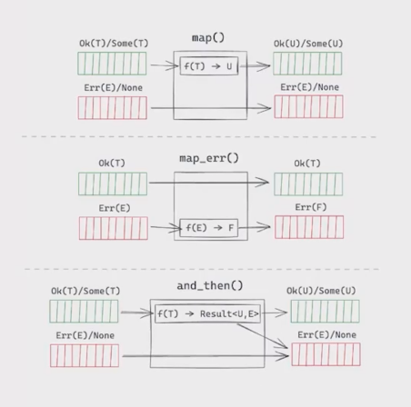

## clap

clap的使用

## serde

serde 用rename这个derive对反序列化的结构体进行重命名

## csv

使用csv进行csv文件的操作

## anyhow

使用anyhow快速生成错误类型

## duckdb

使用duckdb查看csv文件的内容

~~~ shell
duckdb

select * from read_csv('path/to/file.csv', auto_detect=true)
~~~

## tokie

使用tokie查看项目的代码数`

## git

git commit -a

## rand

使用rand库生成随机数

## zxcvbn

查看密码强度

## box & dyn

结合box和dyn进行类型擦除

## base & hash

base64和哈希（如MD5、SHA-1、SHA-256、blake3等）是两种完全不同的概念，它们用于不同的目的：

### base64库 base64

`编码`：Base64是一种编码方法，用于将二进制数据转换为ASCII字符的序列。这种转换使得二进制数据可以通过文本格式传输，例如在电子邮件协议中。

`可逆性`：Base64是可逆的，意味着你可以将Base64编码的字符串解码回原始的二进制数据。

`数据大小`：Base64编码的数据通常比原始数据大约增加1/3。

`用途`：Base64常用于在不支持二进制数据的系统或协议中传输数据，例如在HTML或CSS中嵌入小的图像数据。

### Hash库 blake3

`散列函数`：哈希是一种散列函数，它将输入（或“消息”）转换为固定长度的字符串，通常是一串数字和字母。

`不可逆性`：哈希通常是不可逆的，意味着你不能从哈希值恢复原始数据。

`数据一致性`：同一个输入数据通过同一个哈希函数总是产生相同的输出（哈希值）。

`唯一性`：理想情况下，不同的输入数据应该产生不同的哈希值（尽管理论上会有碰撞）。

`用途`：哈希用于验证数据的完整性，存储密码（通常与盐一起使用），以及数据结构（如哈希表）的实现。

### 主要区别

`目的`：Base64用于数据编码和传输，而哈希用于数据验证和安全性。

`可逆性`：Base64是可逆的，哈希是不可逆的。

`数据大小`：Base64编码的数据比原始数据大，哈希值通常是固定长度的。

`唯一性`：哈希值需要具有唯一性，以避免碰撞，而Base64编码则不关心这一点

## 对称加密库 chacha20poly1305

对称加密，加密解密用同一套公钥

## 非对称加密库 ed25519_dalek 

非对称加密算法，公钥用来加密，私钥用来解密

## awesome_cryptography-rust

[awesome_cryptography-rust](https://github.com/rust-cc/awesome-cryptography-rust)

## tokio

## axum

## tracing

开启日志

~~~shell
Linux: RUST_LOG=info cargo run 

Windows: $env:RUST_LOG="info"
         cargo run
~~~

## vscode 插件 rest http

## Rust 小知识

